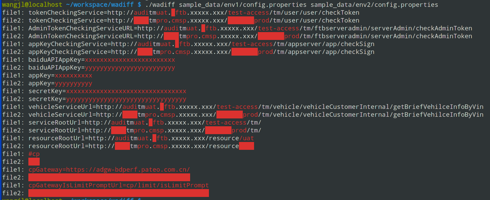
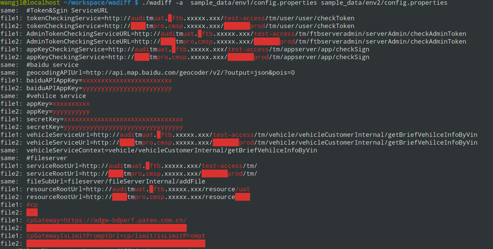
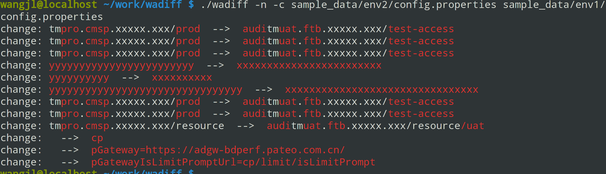

* example: compare strings
````
./wadiff -s neighbouxxr Niijeighbour
   neighbouxxr
Niijeighbou  r

./wadiff -s int-uat.faw-vw.com int.faw-vw.com
int-uat.faw-vw.com
int    .faw-vw.com
````


* example: compare files
````
./wadiff file1 file2
````


* example: compare files and output same and diff lines
````
./wadiff -a  file1 file2
````


* example: compare files and output same and diff lines
````
./wadiff -c [-n]  file1 file2
````

