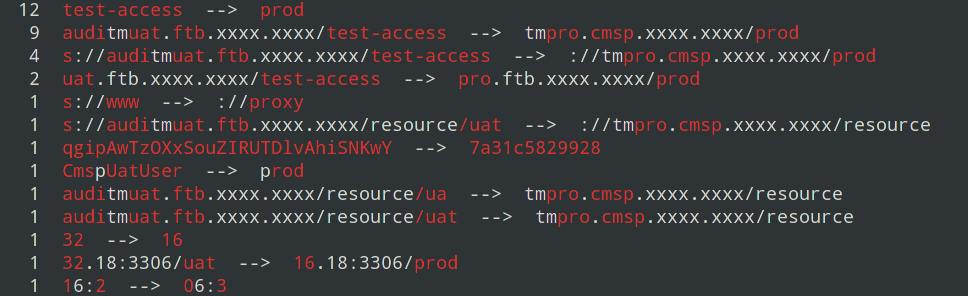

* example: compare strings
````
./wadiff -s neighbouxxr Niijeighbour
   neighbouxxr
Niijeighbou  r

./wadiff -s int-uat.faw-vw.com int.faw-vw.com
int-uat.faw-vw.com
int    .faw-vw.com
````


* example: compare files
````
./wadiff file1 file2
````


* example: compare files and output same and diff lines
````
./wadiff -a  file1 file2
````


* example: compare files and output same and diff lines
````
./wadiff -c [-n]  file1 file2
````


* example: compare configs from uat and prod and suggest vars for templates
````
for d in `ls uat`;do ./wadiff -n -c uat/$d/config.properties  prod/$d/config.properties ;done | sed 's/change://'| sort | uniq -c |sort -nr | awk 'NF>=4{print}'
````


